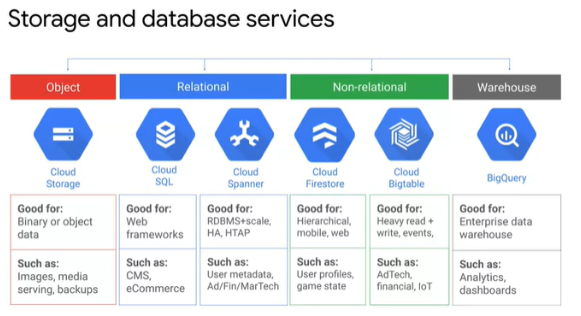
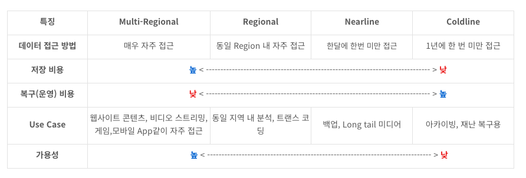
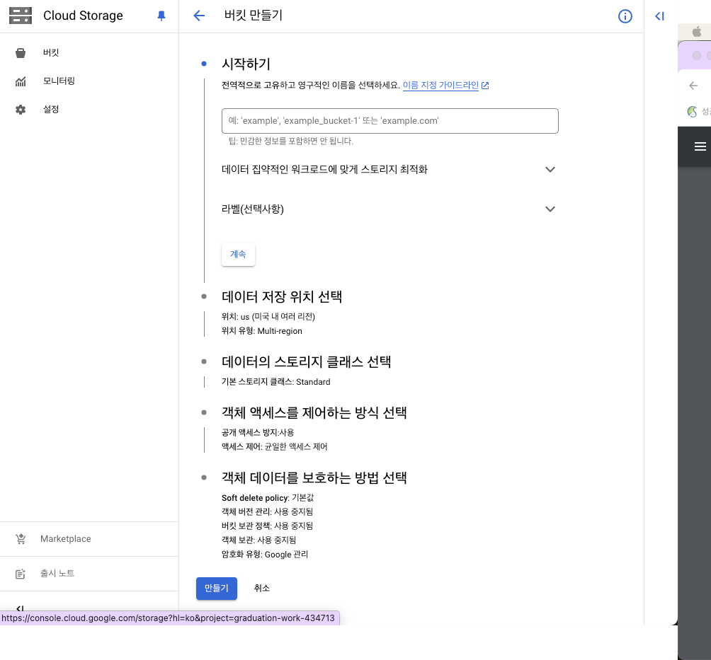

## Google Cloud Storage

Cloud Storage는 Object 저장소로 어디서나 데이터를 저장하고 가져올 수 있는 서비스를 얘기한다.

#### Project란

모든 데이터가 속하는 공간

#### Bucket이란

데이터를 담는 개념으로 `작고` `객체`가 많을수록 좋은 설계이다.

#### Object란

버킷에 저장되는 파일이다.

GCS에 저장되는 파일, Key-Value로 구성 되어 객체의 메타 데이터 두가지 데이터로 구성된다

언제 어디서든 데이터를 중복으로 저장할 수 있고
객체는 변경할 수 없지만 덮어쓰기나 삭제는 가능하다
Repository 등급을 지정하여 등급별로 관리할수 있다.

## GCS 만드는 과정

### 1. Bucket 생성

1. 이름은 고유해야 한다. (전세계에)
2. 도메인으로 지정시 해당 도메인의 실제 소유자인지 확인해야 한다.
3. 
